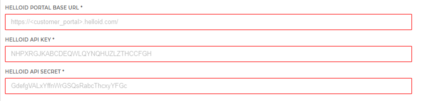

# HelloID-Conn-Prov-Target-HelloID

| :information_source: Information |
|:---------------------------|
| This repository contains the connector and configuration code only. The implementer is responsible to acquire the connection details such as username, password, certificate, etc. You might even need to sign a contract or agreement with the supplier before implementing this connector. Please contact the client's application manager to coordinate the connector requirements.       |

 

  

<!-- TABLE OF CONTENTS -->
## Table of Contents
* [Introduction](#introduction)
* [Getting Started](#getting-started)
  * [Target](#target)
  * [Mappings](#mappings)
  * [Scope](#scope)
* [Setup the PowerShell connector](#setup-the-powershell-connector)

## Introduction
The interface to communicate with HelloID is through a set of API endpoints, which are accessible with the use of the HelloID API Key and Secret. Warning: The API is very powerful, therefore the API key and secret must be kept private and be used with care.
Please see the following page from the HelloID Docs for more information.

[How to create and Manage API Keys](https://docs.helloid.com/hc/en-us/articles/360002741753-How-to-Create-and-Manage-API-Keys)

<!-- GETTING STARTED -->
## Getting Started

By using this connector you will have the ability to create, update and delete accounts from the AFAS Profit HR system.
This connector will also prove you with the ability to assign or revoke groupmemberships as entitlements.

Connecting to Profit is done using API endpoints. An API Key and Secret will be required to connect to these endpoints.
Please see the following page from the HelloID Docs for more information.

[How to create and Manage API Keys](https://docs.helloid.com/hc/en-us/articles/360002741753-How-to-Create-and-Manage-API-Keys)

<!-- USAGE EXAMPLES -->
## Setup the PowerShell connector

1. Add a new 'Target System' to HelloID and make sure to import all the necessary files.

    - [ ] configuration.json
    - [ ] create.ps1
    - [ ] enable.ps1
    - [ ] disable.ps1
    - [ ] delete.ps1
    - [ ] update.ps1
    - [ ] entitlements.ps1
    - [ ] grantPermission.ps1
    - [ ] revokePermission.ps1    

2. Fill in the required fields on the 'Configuration' tab.

_For more information about our HelloID PowerShell connectors, please refer to our general [Documentation](https://docs.helloid.com/hc/en-us/articles/360012558020-How-to-configure-a-custom-PowerShell-target-connector) page_

# HelloID Docs
The official HelloID documentation can be found at: https://docs.helloid.com/
